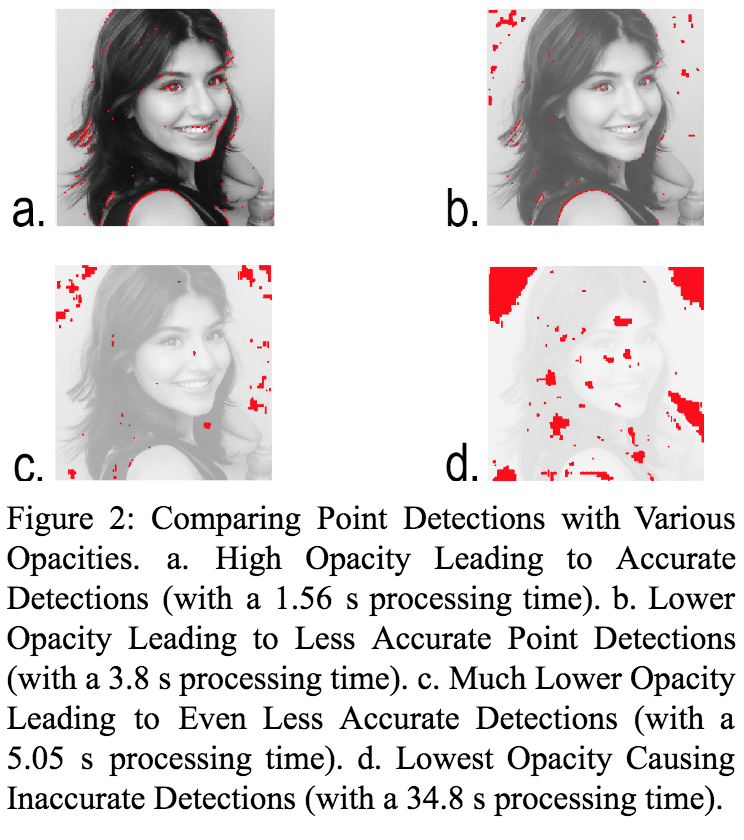
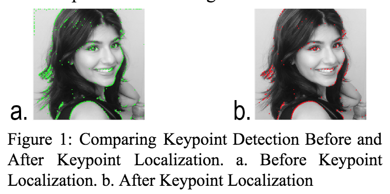

# SIFT 

## Paper & associated research
Read the <a href="https://www.researchgate.net/publication/320310808_Density-based_Clustering_of_Workplace_Effects_on_Mental_Health">associated paper on Methods to improve SIFT</a>

## Goal
Scale invariant feature transform for image processing. This is an investigation of methods to improve SIFT algorithms.

## Execution strategy
1. Images are first transformed into a collection of vectors. 
2. Keypoints (of high contrast) for distinguishing features in the image are identified and stored in a DB
3. Some unstable points can falsely record as keypoints. We avoid this using <b> keypoint localization </b> 
4. The resulting feature vector is denoised. It's much smaller and more accurate.

## Results

	

		
		 
		 
	

	

		
		 
		 
	

## Learnings
Keypoint localization eliminated a significant amount of noise. Varying the image's contrast produced more accurate results, even with keypoint localization.

## Contributors

Shruti Appiah, Mira Sleiman

## License

